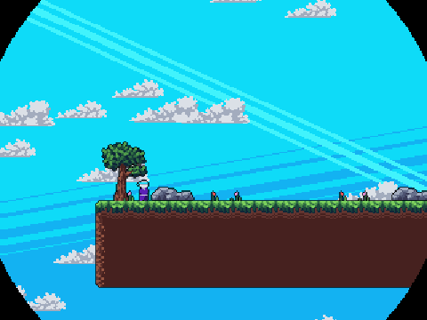
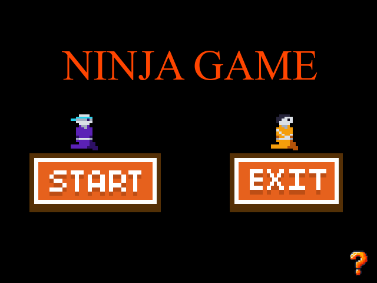
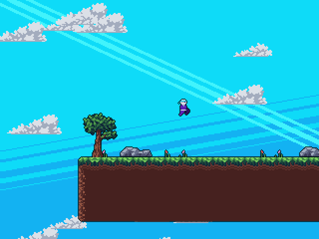
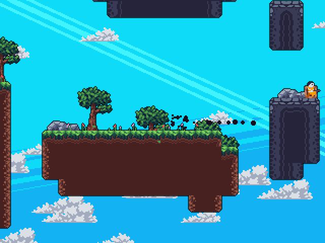
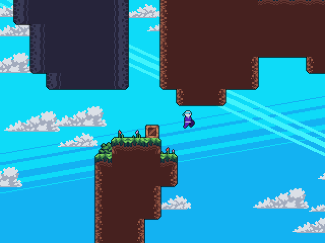

# 🥷 Ninja Platform Game

A pixel-art 2D platformer built with **Python** and **Pygame**. Run, wall-jump and dash through six hand-built levels, taking out every gun-wielding enemy to reach the next stage.

<div align="center">
  
</div>

## ✨ Features

- **Six levels** loaded from JSON tile maps, with a circular transition between stages and a finish screen at the end
- **Fluid movement:** running, jumping, wall sliding, wall jumps and a dash that also works as your attack
- **Enemies that fight back:** they patrol their platforms and shoot when you are on the same height
- **Game feel:** screen shake, spark and particle effects, falling leaves, parallax clouds and sprite outlines
- **Sound:** background music, ambience and sound effects for jumping, dashing, shooting and hits
- **Main menu, tutorial and pause screens**
- **Built-in level editor** (`editor.py`) with auto-tiling, on/off-grid placement and JSON save

## 🎮 Controls

| Key | Action |
| --- | --- |
| `←` `→` | Move |
| `↑` | Jump (press against a wall to wall-jump) |
| `X` | Dash, which defeats any enemy you hit |
| `P` | Pause / resume |
| `Esc` | Close the tutorial screen |

Clear every enemy on a level to advance. Getting shot or falling for too long restarts the current level.

## 🚀 Getting Started

Requirements: **Python 3.8+** and **Pygame 2**.

```bash
git clone https://github.com/ibrahimyankac/Ninja-Platform-Game.git
cd Ninja-Platform-Game
pip install pygame
cd ninja_game
python game.py
```

> Run the game from inside the `ninja_game` folder. Assets are loaded with relative paths such as `data/images/...`.

## 🖼️ Screenshots

<table>
  <tr>
    <td width="50%"></td>
    <td width="50%"></td>
  </tr>
  <tr>
    <td width="50%"></td>
    <td width="50%"></td>
  </tr>
</table>

## 🛠️ Level Editor

```bash
cd ninja_game
python editor.py
```

| Input | Action |
| --- | --- |
| `W` `A` `S` `D` | Move the camera |
| Left click | Place a tile |
| Right click | Remove a tile |
| Mouse wheel | Change tile group |
| `Shift` + mouse wheel | Change tile variant |
| `G` | Toggle grid / free placement |
| `T` | Auto-tile the map |
| `O` | Save to `map.json` |

To use an edited map as a level, copy `map.json` into `data/maps/` with the next level number (for example `6.json`).

## 📁 Project Structure

```
ninja_game/
├─ game.py          # Game loop, menu, tutorial, pause and finish screens
├─ editor.py        # Tile-based level editor
├─ main_menu.py     # Reusable image button
├─ scripts/
│  ├─ entities.py   # Physics, player (jump, wall slide, dash) and enemy AI
│  ├─ tilemap.py    # Tile map loading, saving, collisions and auto-tiling
│  ├─ particle.py   # Particle animations
│  ├─ spark.py      # Spark effects
│  ├─ clouds.py     # Parallax clouds
│  └─ utils.py      # Image loading and animation helpers
└─ data/
   ├─ maps/         # Levels 0–5 as JSON
   ├─ images/       # Sprites, tiles and UI
   └─ sfx/          # Sound effects
```

## 🙏 Credits

The core engine and pixel-art assets follow [DaFluffyPotato](https://www.youtube.com/@DaFluffyPotato)'s Pygame platformer tutorial. The player, enemy and projectile sprites were recolored for this version.
